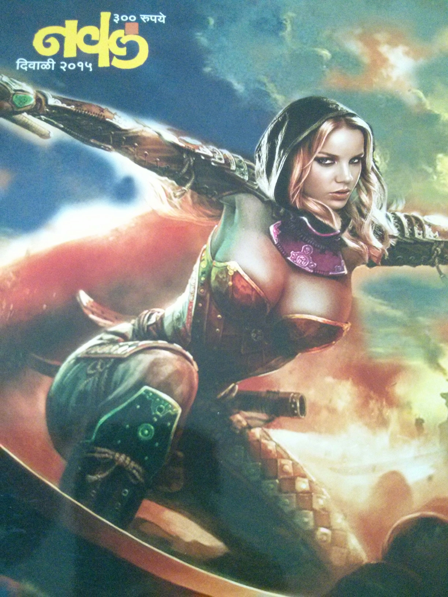

---
# Diwali 2015
linktitle: Diwali 2015
weight: 10

# Page metadata.
title: Diwali 2015
date: "2018-09-09T00:00:00Z"
lastmod: "2018-09-09T00:00:00Z"
draft: false  # Is this a draft? true/false
toc: false  # Show table of contents? true/false
type: docs  # Do not modify.
editable: false

menu:
  diwali:
    name: 2015
    weight: 12
---



<figure>
	
	<figcaption>(.Get 1)</figcaption>
</figure>

<TABLE>
<TR><TD>

antardhvani (naval)
</TD></TR><TR><TD>

ghost writer (dhananjay)
</TD></TR><TR><TD>

<A HREF=../images/MMLAUtsav2015p.pdf>asamI</A> (MMLA - utsav)
</TD></TR>
</TABLE>